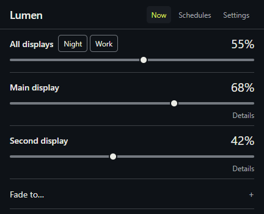

# Lumen

A Windows 10/11 tray app for display brightness, gradual transitions, and schedules.

[Download the latest release](https://github.com/doff256/Lumen/releases/latest) · [MIT license](LICENSE)



## Use

Run the portable EXE, then click Lumen in the system tray. Enable **DDC/CI** in an external monitor's own menu. Supported laptop panels use Windows WMI brightness control.

- **Fade to…:** expand this row when you want a gradual change. Pick a target and 15 minutes, 30 minutes, 1 hour or a custom duration, then Start fade. Smooth perceptual pacing is the default; alternative pacing lives under More options. The popup opens compactly with sliders visible first and grows when you expand controls.
- **Sliders:** brightness changes while dragging, with updates limited to approximately 125 ms and pending values coalesced. Individual sliders show hardware brightness; All displays applies each panel's calibration.
- **Presets:** Night and Work apply to all displays in one click. Their default targets are 20% and 80%; edit them in Settings.
- **Hotkeys:** Ctrl + Alt + Up/Down adjusts every display by 5 percentage points. Disable shortcuts in Settings if they conflict with another app. Registration conflicts are reported.
- **Schedules:** + New opens a sentence-style builder: for example, “Every day at 11:00 PM → Night, over 30 min.” New schedules reference Night or Work; editing a preset changes future occurrences. Existing percentage-based schedules retain their original targets. Choose a one-time date, weekday/time repeat, or sunrise/sunset with an offset. Solar schedules require latitude and longitude and are calculated locally. They follow the computer's local calendar and skip dates without the selected solar event.
- **Calibration:** each display’s Details provides minimum, maximum and target offset. Changes autosave and clamp brightness immediately; limits also clamp every write. Offsets apply to targets and group changes; individual sliders and hotkeys adjust the resulting hardware level directly.
- **Idle dimming:** enable Dim while I’m away in Settings and choose how long to wait. It is off by default. Only mouse and keyboard input count as activity, so video playback can dim too; fullscreen playback is not detected. Activity restores the current brightness or ramp position. Ramps continue on their original timeline while dimmed.

A manual change cancels the selected display's ramp. Start replaces its current ramp. Stop cancels active ramps. Right-click the tray icon to refresh, enable login startup, or quit. Closing the popup leaves the tray app running.

## Sleep, reconnects and saved settings

Display changes and resume trigger a refresh. Lumen reconciles each display to its latest missed schedule occurrence, provided that occurrence is newer than its saved ramp or manual change. An active occurrence resumes at its elapsed curve position. An expired occurrence applies its target immediately. Either replaces an older saved ramp. For example, sleeping during a 23:00 fade to Night and waking after a 07:00 fade to Work ends restores Work. Failed target writes remain pending for retry; disconnected displays reconcile when they reconnect. The last processed time is saved, so the same rule applies after restarting Lumen.

Settings, calibration, schedules and ramps are stored in `settings.json` in Electron's user-data directory, normally `%APPDATA%\lumen-brightness`. Monitors with a usable, unique EDID serial use manufacturer/product/serial identity, which survives port and dock changes when the same EDID is reported. Missing or duplicate serials fall back to device paths, then geometry. Current path IDs migrate automatically to their known EDID identity. For an unresolved older ID, Lumen offers a one-click migration only when exactly one compatible connected display is available; ambiguous matches require reconnecting the original display or recreating its schedule.

## Hardware and architecture

A compiled helper calls `dxva2.dll` for external monitors and `System.Management` for WMI laptop panels. PowerShell is not used. Helpers are reused per display, with independent request streams so a hung panel cannot block another. DDC handles and hardware min/max are cached between refreshes; each slider write calls only the setter. A five-second timeout kills the affected session, and the next request starts a fresh one. Sessions are closed on quit or display topology changes. Discovery failures are reported, working display groups remain available, and individual read failures retain a disabled display row with a warning.

Lumen retains Electron for its UI. A native .NET tray UI could reduce its distribution size and memory use, but is not required for the native display helper. Smooth interpolates in approximate gamma 2.2 perceptual space; actual panel response varies. Some docks, cables and displays do not support DDC/CI. Unresponsive displays are identified in the popup; there is no software dimming fallback.

Builds remain unsigned until signing enrollment is approved, so Windows may show SmartScreen. See the [Code signing policy and SignPath enrollment plan](docs/code-signing.md). Native helper isolation does not replace code signing. There are no accounts, telemetry, location requests, or runtime network calls.

## Development and releases

Use Node.js 22+ and npm on Windows. The native helper uses the .NET Framework C# compiler included with supported Windows versions.

```sh
npm ci
npm test
npm start
npm run test:ui
npm run dist -- --publish never
```

`npm start -- --demo` uses simulated displays. Non-Windows development also uses simulated displays. `test:ui` opens a hidden Electron window, exercises the actual renderer with simulated displays, and refreshes the README screenshot.

Tests cover schedule catch-up, disconnected displays, adapter failures, concurrent/manual writes, calibration, presets, idle restoration, solar events, perceptual curves, helper timeouts, broken pipes and UTF-8. Real DDC compatibility still depends on the connected hardware.

Push a version tag matching `package.json` (for example `v1.2.0`) to test, build the portable EXE and ZIP, and publish them to GitHub Releases. Manual workflow runs produce downloadable build artifacts without publishing a release.
